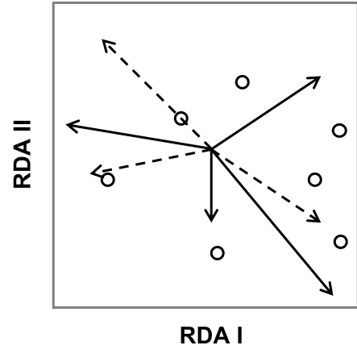

```{r setup, echo = F}
## Setup for your presentation
library(knitr)

opts_chunk$set(
  eval = T,
  cache = T,
  comment = "#",
  collapse = TRUE,
  warning = FALSE,
  message = FALSE,
  fig.width=5, fig.height=5,
  fig.align = 'center'
)


hook_output <- knit_hooks$get("output")
knit_hooks$set(output = function(x, options) {
  lines <- options$output.lines
  if (is.null(lines)) {
    return(hook_output(x, options))  # pass to default hook
  }
  x <- unlist(strsplit(x, "\n"))
  more <- "..."
  if (length(lines)==1) {        # first n lines
    if (length(x) > lines) {
      # truncate the output, but add ....
      x <- c(head(x, lines), more)
    }
  } else {
    x <- c(more, x[lines], more)
  }
  # paste these lines together
  x <- paste(c(x, ""), collapse = "\n")
  hook_output(x, options)
})
```

```{r, echo = F}
mypar = list(mar = c(3,3,1,0.5), mgp = c(1.6, 0.3, 0), tck = -.02, cex = 1.5)

options(repos=structure(c(CRAN="http://cran.r-project.org")))
```

```{r, include = FALSE}
if (!require(vegan)) install.packages("vegan")
library(vegan)
if (!require(ade4)) install.packages("ade4")
library(ade4)
if (!require(scales)) install.packages("scales")
library(scales)
if (!require(sf)) install.packages("sf")
library(sf)
if (!require(raster)) install.packages("raster")
library(raster)
if (!require(RColorBrewer)) install.packages("RColorBrewer")
library(RColorBrewer)
if (!require(mapview)) install.packages("mapview")
library(mapview)
```

class: inverse, center, bottom
background-image: url(https://upload.wikimedia.org/wikipedia/commons/thumb/a/ad/BlankMap-World_gray.svg/1405px-BlankMap-World_gray.svg.png)
background-size: contain

# Mapping with R 
 <br>


---
# Overview of the section


<br>


1. Why mapping in R?

2. Spatial data & Coordinate reference system

3. Vector data with **`sf`**

4. Raster data with **`raster`**

5. Thematic maps

6. Interactive maps

7. Questions, discussion, and use of your data

---
# Packages for this section

<br>

```{r, eval = F}
library(sf) # spatial vector data

library(raster) # spatial raster data

library(RColorBrewer) # color

library(mapview) # interactive map
```

---
# Why mapping in Ecology?

.pull-left[

> [R script for this map](https://mhbrice.github.io/Rspatial/Rspatial_script.html)
]


.pull-left[
1. show where your plots are

2. show how variables are distributed spatially

3. show results of spatial analyses
]

---
# Why using R for mapping?

1. Open-source, free

2. Workflow and reproducibility

3. Quite efficient
    - well-defined spatial classes
    - can read/write/convert many formats

4. Can also be used for spatial data manipulation and analysis as a GIS [](https://mhbrice.github.io/Rspatial/Rspatial_script.html)

---
class: inverse, center, middle
# Spatial data

---
# Vector data

<br><br>

.center[

]


---
# Raster data

<br><br>

.center[

]

---
# Geospatial data in R

.column-left[
#### Abiotic data

- [`raster`](https://cran.r-project.org/web/packages/raster/index.html)
- [`marmap`](https://github.com/ericpante/marmap)
- [`rnoaa`](https://github.com/ropensci/rnoaa)
- [`rWBclimate`](https://github.com/ropensci/rWBclimate)
- [`sdmpredictors`](https://cran.r-project.org/web/packages/sdmpredictors/index.html)
]

.column-center[
#### Biotic data

- [`rgbif`](https://github.com/ropensci/rgbif)
- [`robis`](https://github.com/iobis/robis)
- [`spocc`](https://github.com/ropensci/spocc)
]

.column-right[
#### Base maps

- [`ggmap`](https://github.com/dkahle/ggmap)
- [`mregions`](https://github.com/ropenscilabs/mregions)
- [`osmdata`](https://github.com/ropensci/osmdata)
- [`raster`](https://cran.r-project.org/web/packages/raster/index.html)
- [`rnaturalearth`](https://github.com/ropenscilabs/rnaturalearth)

]


---
class: inverse, center, middle
# Coordinate reference system

.center[

]


---
# Geographic vs projected CRS

```{r canada, echo=F, warning=F, fig.height=4.8, fig.width=9}
can <- raster::getData("GADM", country = "CAN", level = 1, path = "data/")
can_sf <- st_as_sf(can)

qc <- can_sf[can_sf$NAME_1 == "Québec",]
qc_prj <- st_transform(qc, 32188)
qc_simple_prj <- st_simplify(qc_prj, dTolerance = 500)
qc_simple <- st_transform(qc_simple_prj, 4326)

par(mfrow=c(1,2), mar = c(2,3,2,1))
plot(st_geometry(qc_simple), main = "Geographic CRS - Lat/Lon", graticule=T, axes=T, cex.axis=0.8, las=1)
plot(st_geometry(qc_simple_prj), main = "Projected CRS - UTM", graticule=st_crs(qc_simple_prj), axes=T, cex.axis=0.8, las=1)
```

> [What are geographic coordinate systems?](http://desktop.arcgis.com/en/arcmap/10.3/guide-books/map-projections/about-geographic-coordinate-systems.htm)
> <br>
> [What are projected coordinate systems?](http://desktop.arcgis.com/en/arcmap/10.3/guide-books/map-projections/about-projected-coordinate-systems.htm)

---
# Define CRS with EPSG or proj4string

Many, many ways to represent the 3-D shape of the earth and to project it in a 2-D plane

- each CRS can be defined either by an `EPSG` or a `proj4string`

> The EPSG code is a numeric representation of a CRS, while the proj4string reprensents the full set of parameters spelled out in a string:
> <br>
> EPSG `4326` <=> proj4 `+proj=longlat +ellps=WGS84 +datum=WGS84 +no_defs`
> <br>
> EPSG `32188` <=> proj4 `+proj=tmerc +lat_0=0 +lon_0=-73.5 +k=0.9999 +x_0=304800 +y_0=0 +ellps=GRS80 +datum=NAD83 +units=m +no_defs`

- All geographic files are created using a specific CRS - but it's not always defined!

- To find CRS in any format: [Spatial Reference](http://spatialreference.org/)

---
class: inverse, center, middle
# Vector data with `sf`

---
# Intro to Simple Features


Why use the `sf` package when `sp` is already tried and tested?

- .alert[Simple features refers to a formal standard] (ISO 19125-1:2004) that describes
how objects in the real world can be represented in computers

- .alert[successor of `sp`]

- .alert[`sf` combines the functionality of the 3 main packages of the `sp` paradigm]:
    1. `sp` for the class system;
    2. `rgdal` for reading and writing data;
    3. `rgeos` for spatial operations undertaken by GEOS.

- .alert[`sf` objects are easy to plot, manipulate, import and export]
  - Spatial objects are stored as data frames, with the feature geometries stored in list-columns
  - `tidyverse` friendly

- .alert[GREAT documentation!] See [sf vignettes](https://cran.rstudio.com/web/packages/sf/index.html)

---
# Intro to Simple Features

.center[

]

---
# Intro to Simple Features


> [sf vignette #1](https://cran.r-project.org/web/packages/sf/vignettes/sf1.html)


---
# Geospatial data in R

We will create a thematic map of Quebec as our sampled area using data readily available in R using `getData()` from the `raster` package:
- Canadian provincial boundaries - vector data
- Climate data - raster data


```{r getdata, eval = F}
# Create a new directory
dir.create("data")

can <- getData("GADM", country = "CAN", level = 1, path = "data")

can
```

```{r, echo=F}
can
```

---
# Prep vector data 

Convert from `sp` to `sf` objects to facilitate manipulation

```{r st_sf, eval = F}
can_sf <- st_as_sf(can)

can_sf[1:3,]
```

```{r, echo = F}
can_sf[1:3,]
```

---
# Prep vector data 

Retrieve Quebec and surrounding provinces

```{r getQc, message = F}
neigh <- c("Québec", "Ontario", "Nova Scotia", 
           "New Brunswick", "Newfoundland and Labrador")
qc_neigh <- dplyr::filter(can_sf, NAME_1 %in% neigh)

# or using base R
# qc_neigh <- can_sf[can_sf$NAME_1 %in% neigh,]

qc_neigh
```


---
# Prep vector data 

Change projection for a better representation of Quebec. 

> Here, I chose EPSG 32188 which corresponds to NAD83 - MTM zone 9 

```{r qc_proj, message = F}
qc_neigh_prj <- st_transform(qc_neigh, crs = 32188)

qc_neigh_prj
```

--
It would take a while to plot because there is a lot of unnecessary details, so
we can simplify the shape of the polygons using `st_simplify()`.

```{r simplify}
qc_neigh_simple <- st_simplify(qc_neigh_prj, 
                               dTolerance = 1000) # simplify geometry at a 1km scale)
```

---
# Simple plot

Instead of creating a single map, the default plot of `sf` object creates multiple maps, one for each attribute. This is often useful for exploring the spatial distribution of different variables.

```{r base_plot, message = F, fig.height=6, fig.width=6, echo = -1}
par(mypar)
plot(qc_neigh_simple)
```

---
# Simple plot

```{r map_1, echo = -1, fig.width=9, fig.height=7}
par(mypar)
# retrieve Québec only
qc_simple <- dplyr::filter(qc_neigh_simple, NAME_1=="Québec")

plot(st_geometry(qc_neigh_simple), col = "grey65")
plot(st_geometry(qc_simple), col = "blue3", add = T)
```

---
# Create a layer of `MULTIPOINTS`

Let's say we sampled vegetation in 100 plots across Québec; we now want to plot them
with points proportional to their species richness. We will now create a data
frame containing coordinates and random values from 5 to 50.

```{r points, message = F}
# Sample random points from our study area
sample_pts <- st_sample(x = qc_simple, size = 100)

# Create an attribute of fake species richness (with 5 to 50 species per plot)
richness <- sample(x = 5:50, size = length(sample_pts), replace = TRUE)

sample_pts <- st_sf(sample_pts, richness = richness)

sample_pts
```

---
# Get bioclimatic rasters

If we were interested in the latitudinal temperature gradient, we could add a
raster of mean annual temperature (`bio1`) as a background to our map.

We will use a low resolution so it does not take too long to plot.

```{r temp, message = F, fig.width=9}
bioclim <- getData("worldclim", var = "bio", res = 10, path = "data")

# There are 19 layers in this raster.
plot(bioclim)
```


---
# Prep raster data

Look at the annual mean temperature raster data, `bio1`:

```{r bio1}
bioclim$bio1
```

--

We need to divide by 10 (because Worldclim temperature data are in °C * 10)

```{r bio1_prep, message = F}
temp <- bioclim$bio1/10

temp
```

---
# Prep raster data - projection

Change projection to match with the polygons using `projectRaster()`.

- `projectRaster()` requires the PROJ.4 format of the CRS: 

```{r}
st_crs(qc_simple)$proj4string
```


```{r raster_prj, message = F}
temp_prj <- projectRaster(temp, crs = st_crs(qc_simple)$proj4string)
```

---
# Prep raster data - crop and mask

1. `crop()` decreases the extent of a raster using the extent of another spatial object. `crop()` expects a `sp` object, so we need to transform the polygon first.
2. `mask()` keeps the raster values only in the area of interest and set the rest to NA.

```{r crop}
temp_crop <- crop(temp_prj, as(qc_simple, "Spatial"))
temp_mask <- mask(temp_crop, qc_simple)
```

```{r, echo = -1, fig.width=8, fig.height=4.5}
par(mypar)
par(mfrow = c(1,2))
plot(temp_crop, main = "crop")
plot(temp_mask, main = "mask")
```

---
class: inverse, center, middle

# Thematic map


---
# Creating a simple layout

```{r layout}
my.layout <- layout(matrix(1:2, 2), heights = c(1,.2))
layout.show(my.layout)
```

---
# Define color palette

Palette of color for the temperature raster using `brewer.pal()` and `colorRampPalette()`

```{r color, echo = -1, fig.height=2.5}
par(mar=c(4,1,.5,1))
display.brewer.pal(11, "RdYlBu")

mypal1 <- rev(brewer.pal(11, "RdYlBu"))
mypal1
mypal2 <- colorRampPalette(mypal1)
mypal2(16)

mypal <- mypal2(200)
```

---
# Step by step thematic map

Plot neighbor provinces as background

```{r, fig.width = 5.5, fig.height = 6}
layout(matrix(1:2, 2), heights = c(1,.2))
par(las = 1, xaxs='i', yaxs='i', mar = c(2,3,0,0))

plot(st_geometry(qc_neigh_simple),
     col = '#b5cfbd', border = 'grey50',
     axes = T, graticule = T) # add graticules
```


---
# Step by step thematic map

Add the temperature raster
```{r, echo = 4, fig.width = 5.5, fig.height = 6}
layout(matrix(1:2, 2), heights = c(1,.2))
par(las = 1, xaxs='i', yaxs='i', mar = c(2,3,0,0))
plot(st_geometry(qc_neigh_simple),
     col = '#b5cfbd', border = 'grey50',
     axes = T, graticule = T) # add graticules
image(temp_mask, add = T, col = mypal)
```

---
# Step by step thematic map

Add the Quebec polygon's boundary on top
```{r, echo = 5, fig.width = 5.5, fig.height = 6}
layout(matrix(1:2, 2), heights = c(1,.2))
par(las = 1, xaxs='i', yaxs='i', mar = c(2,3,0,0))
plot(st_geometry(qc_neigh_simple),
     col = '#b5cfbd', border = 'grey50',
     axes = T, graticule = T) # add graticules
image(temp_mask, add = T, col = mypal)
plot(st_geometry(qc_simple), add = T, 
     border = 'grey15', lwd = 1.4)
```


---
# Step by step thematic map

Add sample points with size proportional to their species richness
```{r, echo = 6, fig.width = 5.5, fig.height = 6}
layout(matrix(1:2, 2), heights = c(1,.2))
par(las = 1, xaxs='i', yaxs='i', mar = c(2,3,0,0))
plot(st_geometry(qc_neigh_simple),
     col = '#b5cfbd', border = 'grey50',
     axes = T, graticule = T) # add graticules
image(temp_mask, add = T, col = mypal)
plot(st_geometry(qc_simple), add = T, 
     border = 'grey15', lwd = 1.4)
plot(st_geometry(sample_pts), add = T, pch = 21,
     bg = "#63636388", col = "grey15", lwd = 1.4,
     cex = sample_pts$richness/25) # Size proportional to richness
```


---
# Step by step thematic map

Create a color legend manually

```{r, echo = -1, fig.height=5}
par(mypar)
val <- range(values(temp_mask), na.rm = T)
val

mat <- as.matrix(seq(val[1], val[2], length = 200))
                 
image(x = mat[,1], y = 1, z = mat, col = mypal, axes = F, ann = F)
axis(1)
mtext(side = 1, line = 1.8, text = 'Mean annual temperature (°C)')
```

---
# Step by step thematic map

Add the color legend under the map
```{r, echo = 7:9, fig.width = 5.5, fig.height = 6}
layout(matrix(1:2, 2), heights = c(1,.2))
par(las = 1, xaxs='i', yaxs='i', mar = c(2,3,0.1,0.1))
plot(st_geometry(qc_neigh_simple),
     col = '#b5cfbd', border = 'grey50',
     axes = T, graticule = T) # add graticules
image(temp_mask, add = T, col = mypal)
plot(st_geometry(qc_simple), add = T, 
     border = 'grey15', lwd = 1.4)
plot(st_geometry(sample_pts), add = T, pch = 21,
     bg = "#63636388", col = "grey15", lwd = 1.4,
     cex = sample_pts$richness/25) # Size proportional to richness
par(mar = c(3,4,1,4))
image(x = mat[,1], y = 1, z = mat, col = mypal, axes = F, ann = F)
axis(1, cex.axis = .8)
mtext(side = 1, line = 1.8, text = 'Mean annual temperature (°C)')
```

---
class: inverse, center, middle
# Interactive map

---
# Interactive map


```{r mapview1, fig.width=11, fig.height=6.5}
mapView(qc_simple)
```


---
# Interactive map

```{r mapview_pts, fig.width=11, fig.height=6.5}
mapView(sample_pts, layer.name = "Species richness")
```

---
# Interactive map

```{r mapview3, fig.width=11, fig.height=6.5}
mapView(sample_pts, col.regions = "red", cex = 'richness', legend = F, 
        map.types = "Esri.WorldImagery")
```

---
# Great online resources

.pull-left[
#### Good tutorials for spatial data in R

- [Raster analysis in R](https://mgimond.github.io/megug2017/)
- [Geocomputation with R](https://geocompr.robinlovelace.net/intro.html)
- [Spatial data in R](https://github.com/Pakillo/R-GIS-tutorial/blob/master/R-GIS_tutorial.md)
- [Document par Nicolas Casajus (fr)](https://qcbs.ca/wiki/_media/gisonr.pdf)
- [r-spatial](http://r-spatial.org/)
- [Tutorial on datacamp](https://www.datacamp.com/courses/spatial-analysis-in-r-with-sf-and-raster)
- [R in space - Insileco](https://insileco.github.io/2018/04/14/r-in-space---a-series/)
- [Geospatial analyses & maps with R](https://mhbrice.github.io/Rspatial/Rspatial_script.html)

#### Get free data

- [free data at country level](http://www.diva-gis.org/gdata)
- [Quebec free data](http://mffp.gouv.qc.ca/le-ministere/acces-aux-donnees-gratuites/)
- [find more spatial data](https://freegisdata.rtwilson.com/)
- [create shapefile on line](http://geojson.io/)
- EPSG: [link1](http://spatialreference.org/); [link2](http://epsg.io/)

]

.pull-right[

#### Maps in R

- [Introduction to visualising spatial data in R](https://cran.r-project.org/doc/contrib/intro-spatial-rl.pdf)
- [Geocomputation with R](https://geocompr.robinlovelace.net/adv-map.html)
- [choropleth](https://cengel.github.io/rspatial/4_Mapping.nb.html)
- [leaflet](https://rstudio.github.io/leaflet/)
- [Mapview](https://r-spatial.github.io/mapview/index.html)
- [tmap](https://cran.r-project.org/web/packages/tmap/vignettes/tmap-nutshell.html)
- [plotly](https://plot.ly/python/maps/)
- [Animated maps](https://insileco.github.io/2017/07/05/animations-in-r-time-series-of-erythemal-irradiance-in-the-st.-lawrence/)

#### `sf` manipulations

- [sf vignette #4](https://cran.r-project.org/web/packages/sf/vignettes/sf4.html)
- [Geocomputation with R](https://geocompr.robinlovelace.net/attr.html)
- [Attribute manipulations](https://insileco.github.io/2018/04/09/r-in-space---attribute-manipulations/)
- [Tidy spatial data in R](http://strimas.com/r/tidy-sf/)

]

---
class: inverse, center, bottom

.center[

]
# Introduction to ordination

## Principal component analysis (PCA) 

## Redundancy analysis (RDA)


---
# Ordination of multivariate data

<br>

.center[]

---
# Ordination of multivariate data

<br>

.center[]

---
# Ordination of multivariate data

<br>

.center[]

---
# Unconstrained vs constrained ordinations

**Unconstrained ordination**

- Reveal the main patterns in multivariate data (e.g. matrix of species abundance at different sites or matrix of environmental variables at different sites)
- Describe relationship among variables of one matrix.
- Descriptive method: no statistical test

**Constrained/canonical ordination**

- Explicitly puts into relationship two matrices: one dependent matrix and one explanatory matrix.
- This approach combines the techniques of ordination and multiple regression.
- Explanatory method: statistical test

<br>
*Both types of ordination are based upon a comparison of all possible pairs of objects (or descriptors) using association measures.*

---
# Unconstrained vs constrained ordinations

<br>

| Response data | Explanatory variables  | Analysis            |
|---------------|------------------------|---------------------|
| 1 variable    | 1 variable             | Simple regression   |
| 1 variable    | m variables            | Multiple regression |
| p variables   | -                      | Simple ordination   |
| p variables   | m variables            | Canonical ordination|

---
# Steps to ordination

1. Explore your data:
  - multivariate data, species abundance or environmental variables, 1 or 2 matrices
2. Prep your data
3. Perform an ordination analysis:
  - Unconstrained to describe 1 matrix
  - Constrained to explain the species matrix by the environmental matrix
4. Interpret the output
5. Plot
6. For constrained ordination: variable selection + test of significance

---
# Packages for this section

```{r, eval = F}
library(vegan) # for all multivariate methods

library(ade4) # for the Doubs dataset

library(scales) # for color transparency
```

---
class: inverse, center, middle
# Explore data

---
# Doubs River Fish Dataset

.pull-left[

Verneaux (1973) dataset:
- characterization of fish communities
- 27 different species
- 30 different sites
- 11 environmental variables

Load the Doubs River species data

```{r}
data(doubs) # available in ade4
spe <- doubs$fish
env <- doubs$env
```

]

.pull.right[

]

---
# Explore environmental data

```{r, echo = T}
head(env) # first 6 rows
```

---
# Explore environmental data

```{r, fig.width=11, fig.height=10, echo = -1}
par(mar=c(0,0,0,0))
pairs(env)
```

---
# Explore species data

```{r}
head(spe)
```

---
# Explore species data

Take a look at the distribution of species frequencies  

```{r, fig.width=8, echo = -1}
par(mypar)
ab <- table(unlist(spe))
barplot(ab, las = 1, col = grey(5:0/5),
        xlab = "Abundance class", ylab = "Frequency")
```

.alert[Note the proportion of 0s.]

---
# Double zero

**How do we interpret the double absence of species in a matrix of species abundances (or presence-absence)?**


- the *presence* of a species in 2 sites indicates ecological resemblance between these 2 sites
  - the sites provide a set of minimal conditions allowing the species to survive.

- the *absence* of a species from 2 sites cannot be interpreted as a resemblance because it may be due to a variety of causes: competition, several dimensions of the niche (pH, light, temperature...), random dispersal process.


.alert[A measured 0 (e.g 0mg/L, 0°C) is not the same than a 0 representing an absence of observation]

---
class: inverse, center, middle
# Data preparation

---
# Distance measures

.comment[Ordination analysis are based on the comparison of all possible pairs of objects.

PCA and RDA are based on the Euclidean distance.]

<br>

Here we want to measure the ecological resemblance (distance or similarity) among sites.


- If we compare the sites based on their **environmental variables**, we can use the **Eucidean distance**

- If we compare the sites based on their **species composition**, we don't want to consider double-zero as a similarity. **Euclidean distance is not appropriate**.
  - Solution 1: **Pre-transform** the species matrix to trick the PCA or RDA to use an appropriate distance such as Hellinger.
  - Solution 2: Run a correspondance analysis (CA) which is based on the Chi-square distance
  - Solution 3: Compute a distance matrix from the species matrix and run a PCoA

---
# Standardization of environmental data

Standardizing environmental variables is necessary as you cannot compare the effects of variables with different units

```{r}
env.z <- decostand(env, method = "standardize")
# env.z <- scale(env)
```

Standardization centers (mean $\mu$ = 0) and scales (standard deviation $\sigma$ = 1) the variables

```{r}
apply(env.z, 2, mean)

apply(env.z, 2, sd)
```

---
# Transforming species community data

<br>

.center[
]

---
# Transforming species community data

.alert[Hellinger transformation]

```{r}
spe.hel <- decostand(spe, method = "hellinger")
```

Other transformation methods:

`method = "chi.square"`  **$\chi^2$**. When using this transformation in a PCA, the result will be similar to the result of a correspondance analysis (CA)

`method = "normalize"`  **Chord transformation**

`method = "total"`   **Species profile transformation**

> According to [Legendre & Gallagher](http://adn.biol.umontreal.ca/~numericalecology/Reprints/Legendre_&_Gallagher.pdf): The Hellinger and chord transformations appear to be the best for general use with species data.

---
class: inverse, center, middle
# Unconstrained ordination
## PCA


---
# Principal Component Analysis (PCA)

- Starting from a multidimensional sites x descriptors matrix
  - where the descriptors can be species abundance (or presence-absence) or environmental variables

- A PCA will preserve the maximum amount of variation in the data in a reduced number of dimensions (usually we use the first 2 dimensions)

- The resulting, synthetic variables are orthogonal (i.e. perpendicular and therefore uncorrelated)

.center[
]

---
# PCA - Multidimensional case

<br/><br/>

- **PC1**  axis that maximizes the variance of the points that are projected perpendicularly onto the axis.
- **PC2**  must be perpendicular to PC1, but the direction is again the one in which variance is maximized when points are perpendicularly projected
- **PC3**  and so on: perpendicular to the first two axes

<br/>

.red[For a matrix containing *p* descriptors, a PCA produces *p* axes which are ordered according to the % of variation of the data they explain]


---
# PCA - Let's try it on the fish dataset!

- For both PCA and RDA, we can use the `rda()` function from the vegan package
  - `rda(Y ~ X)` or `rda(Y, X)`  RDA
  - `rda(Y)` or `rda(X)`  PCA

---
# PCA

- Run a PCA on the Hellinger-transformed fish data and extract the results

```{r, output.lines = 1:20}
spe.h.pca <- rda(spe.hel)

summary(spe.h.pca)
```

---
#PCA - Interpretation of Output

```{r, output.lines = 2:8}
summary(spe.h.pca)
```

- `Inertia`  general term for "variation" in the data.
- Total variance of the dataset (here the fish species) = 0.5023
- In PCA, note that the "Total" and "Unconstrained" portion of the inertia is identical

---
# PCA - Interpretation of Output

<br/>

```{r, output.lines = 2:16}
summary(spe.h.pca)
```

- `Eigenvalue`  measures the amount of variation represented by each ordination axe (Principal Component or PC)
- One eigenvalue associated to each PC (in this output there are 27 PCs, as this is the number of species)


<br/>

.center[**0.2491 + 0.06592 + ... = 0.5023 Total inertia**]

---
# PCA - Interpretation of Output

```{r, output.lines = 2:16}
summary(spe.h.pca)
```


- `Proportion Explained`  proportion of variation accounted for, by dividing the eigenvalues by the total inertia.

<br/>

.center[**0.2491/0.5023 = 0.4959 or 49.59%**]


---
# PCA - Interpretation of Output

```{r, output.lines = 40:50}
summary(spe.h.pca)
```


- `Species scores`  coordinates of all descriptors in the multidimensional space of the PCA.

<br>

- Species always refers to your descriptors (the columns in your matrix), here the fish species. Even if you run a PCA on environmental variables, the descriptors will still be called Species scores

---
# PCA - Interpretation of Output

```{r, output.lines = 72:82}
summary(spe.h.pca)
```

- `Site scores`  coordinates of all sites in the multidimensional space of the PCA.

<br>

- Site refers to the rows in your dataset, here the different sites along the Doubs river (but it can be points in time, etc)


---
# Selecting Important PCs

Select PCs which capture more variance than the average (Kaiser-Guttman criterion)


```{r, echo = -1, fig.width=10, fig.height = 5.5}
par(mypar)
ev <- spe.h.pca$CA$eig # extract eigenvalues
barplot(ev, main = "Eigenvalues", col = "grey", las = 2)
abline(h = mean(ev), col = "red3", lwd = 2)
```


---
# PCA - environmental variables

We can also run PCAs on standardized environmental variables, to compare environmental conditions of sites or how environmental variables are correlated...

- Run a PCA on the standardized environmental variables and extract the results
```{r, output.lines = 1:20}
env.pca <- rda(env.z)
summary(env.pca)
```

---
# PCA - environmental variables

- Plot the eigenvalues above average

```{r, echo = -1, fig.width=10, fig.height = 5.5}
par(mypar)
ev <- env.pca$CA$eig # extract eigenvalues
barplot(ev, main = "Eigenvalues", col = "grey", las = 2)
abline(h = mean(ev), col = "red3", lwd = 2)
```

---
# PCA - Visualization

The abundance of information produced by PCA is easier to understand and interpret using biplots to visualize patterns

- We can produce a quick biplot of the PCA using the function `biplot()` in base R

```{r, echo = -1}
par(mypar)
biplot(spe.h.pca)
```

---
# PCA - Scaling

```{r, echo = -1, fig.height=5, fig.width=10}
par(mypar, mfrow = c(1,2))
biplot(spe.h.pca, scaling = 1, main = "Scaling 1 = distance biplot")
biplot(spe.h.pca, scaling = 2, main = "Scaling 2 = correlation biplot")
```

- In a PCA, we interpret the .purple[**correlation among species**] by looking at the angles among their arrows, while we interpret the .purple[**distance among sites**].

- However, we cannot optimally display sites and species together in a PCA biplot.

---
# PCA - Scaling

```{r, echo = F, fig.height=4.5, fig.width=9}
par(mypar, mfrow = c(1,2))
biplot(spe.h.pca, scaling = 1, main = "Scaling 1 = distance biplot")
biplot(spe.h.pca, scaling = 2, main = "Scaling 2 = correlation biplot")
```

.pull-left[
**Scaling 1**:
- distances among objects are approximations of Euclidean distances;
- the angles among descriptors vector are meaningless.

.alert[Best for interpreting relationships among objects (sites)!]
]

.pull-right[**Scaling 2** (Default):
- angles between descriptors vectors reflect their correlations;
- distances among objects are not approximations of Euclidean distances.

.alert[Best for interpreting relationships among descriptors (species)!]
]

---
# Customized biplot

- Extract species and site scores along the 1st and 2nd PC:
```{r}
spe.scores <- scores(spe.h.pca, display = "species", choices = 1:2)

site.scores <- scores(spe.h.pca, display = "sites", choices = 1:2)
```

- Extract % of variation on the 1st and 2nd PC:
```{r}
prop1 <- round(spe.h.pca$CA$eig[1]/sum(spe.h.pca$CA$eig)*100, 2)

prop2 <- round(spe.h.pca$CA$eig[2]/sum(spe.h.pca$CA$eig)*100, 2)
```

---
# Customized biplot

Empty plot with informative axis labels
```{r, echo = -1}
par(mypar)
plot(spe.h.pca, type = "none",
     xlab = paste0("PC1 (", prop1, "%)"),
     ylab = paste0("PC2 (", prop2, "%)"))
```

---
# Customized biplot

Add points for sites
```{r, echo = 3}
par(mypar)
plot(spe.h.pca, type = "none",
     xlab = paste0("PC1 (", prop1, "%)"),
     ylab = paste0("PC2 (", prop2, "%)"))
points(site.scores,
       pch = 21, bg = "steelblue", cex  = 1.2)
```

---
# Customized biplot

Add arrows for species
```{r, echo = 4}
par(mypar)
plot(spe.h.pca, type = "none",
     xlab = paste0("PC1 (", prop1, "%)"),
     ylab = paste0("PC2 (", prop2, "%)"))
points(site.scores,
       pch = 21, bg = "steelblue", cex  = 1.2)
arrows(x0 = 0, y0 = 0,
       x1 = spe.scores[,1], y1 = spe.scores[,2],
       length = 0.1) # size of arrow head
```

---
# Customized biplot

Add labels for species
```{r, echo = 5}
par(mypar)
plot(spe.h.pca, type = "none",
     xlab = paste0("PC1 (", prop1, "%)"),
     ylab = paste0("PC2 (", prop2, "%)"))
points(site.scores,
       pch = 21, bg = "steelblue", cex  = 1.2)
arrows(x0 = 0, y0 = 0,
       x1 = spe.scores[,1], y1 = spe.scores[,2],
       length = 0.1)
text(spe.scores[,1], spe.scores[,2],
     labels = rownames(spe.scores),
     col = "red3", cex = 0.8)
```


---
# Customized biplot

Complete code for the biplot
```{r, eval = F}
plot(spe.h.pca, type = "none",
     xlab = paste0("PC1 (", prop1, "%)"),
     ylab = paste0("PC2 (", prop2, "%)"))
points(site.scores,
       pch = 21, bg = "steelblue", cex  = 1.2)
arrows(x0 = 0, y0 = 0,
       x1 = spe.scores[,1], y1 = spe.scores[,2],
       length = 0.1)
text(spe.scores[,1], spe.scores[,2],
     labels = rownames(spe.scores),
     col = "red3", cex = 0.8)
```

---
class: inverse, center, middle

# Constrained ordinations

## Redundancy analysis - RDA

---
# RDA

- RDA = combination of multiple regressions and a PCA.

- It allow us to identify and test relationships between a response matrix and explanatory matrix or matrices

.center[ ]

- Explanatory variables can be quantitative, qualitative, or binary (0/1).

<br>
- .alert[Transform] species data and .alert[standardize] quantitative variables prior to running a RDA.

---
# Run the RDA

- Model the effect of all environmental variables on fish community composition

```{r}
spe.rda <- rda(spe.hel ~., data = env.z) # "~." indicates all variables
# or spe.rda <- rda(X = spe.hel, Y = env.z)
```

- .comment[It is better to use the formula interface which is more flexible (allows for factors and interaction among variables)], for example: 
  - `rda(spe.hel ~ var1 + var2*var3 + fac, data = env.z)`
- You can also control for a group of variables, for example you are interested in the effect var1,2,3 while holding constant var4,5:  
  - `rda(spe.hel ~ var1 + var2*var3 + Condition(var4 + var5), data = env.z)`

---
# RDA output in R

```{r, output.lines = 1:9}
summary(spe.rda)
```

- **`Constrained Proportion`**  variance of the response matrix explained by the environmental matrix
 - .alert[(0.3557/0.5023 = 70.81%)]
 - Equivalent of unadjusted R2
- **`Unconstained Proportion`**  unexplained variance in the response matrix (residuals)
  - .alert[(0.1467/0.5023 = 29.21%)]  


---
# RDA output in R

```{r, output.lines = 11:25}
summary(spe.rda)
```

- **`Eigenvalues, and their contribution to the variance`**  eigenvalues for the canonical axes (RDA1 to RDA11) and the unconstrained axes (PC1 to PC18), as well as the cumulative proportion of .purple[**variance explained by the RDA axes**] and .purple[**represented by the residual PC axes**].
- The first 2 RDA axes cumulatively explain 55% of the fish community variance.

---
# Selecting variables

Using .alert[stepwise selection], we can select the explanatory variables that are significant.  


```{r}
# Forward selection of variables:
mod0 <- rda(spe.hel ~ 1, data = env.z)  # Model with intercept only
rda.sel <- ordiR2step(mod0, # lower model limit
               scope = formula(spe.rda), # upper model limit (full model)
               direction = "forward", # could be backward or both
               R2scope = TRUE, # can't surpass the full model's R2
               step = 1000,
               trace = FALSE) # change to TRUE to see the selection process!
```

.comment[Here, we are essentially adding one variable at a time, and retaining it if it significantly increases the model's adjusted R2.]

---
# Selecting variables

- Which variables are retained by the forward selection?
```{r}
rda.sel$call
```


- What is the **adjusted R2** of the RDA with the selected variables?
```{r}
RsquareAdj(rda.sel)
```

How would you report these results in a paper?  
- .comment[The selected environmental variables (dfs + oxy + bdo) explain .alert[51.43%] of the variation in fish community composition in the 30 sites along the Doubs river.]
- Note: you should report the adjusted R2 which takes into account the number of explanatory variables.

---
# Significance testing

Use `anova.cca()` to test the significance of your RDA.
```{r}
anova.cca(rda.sel, step = 1000)
```

You can also test the significance of each axis!
```{r, eval = F}
anova.cca(rda.sel, step = 1000, by = "axis")
```

... and of each variable!
```{r, eval = F}
anova.cca(rda.sel, step = 1000, by = "term")
```

.center[
.alert[ If your global test is not significant, RDA results should not be interpreted!]
]


---
# RDA - Visualization

The RDA allows the **simultaneous visualization** of your response and explanatory variables

```{r, echo=-1, fig.width=11, fig.height=4.5}
par(mfrow = c(1,2), mar=c(4,4,0,1), cex = 1.5)
ordiplot(rda.sel, scaling = 1, type = "text")
ordiplot(rda.sel, scaling = 2, type = "text")
```

.pull-left[
**Scaling 1** distances among objects reflect their similarities
]

.pull-right[
**Scaling 2** angles between variables (species and explanatory variables) reflect their correlation
]

---
# RDA triplot - Scaling

### Scaling 1 – .comment[distance triplot]

.pull-left[
```{r, echo=F}
par(mypar)
ordiplot(rda.sel, scaling = 1, type = "text")
arrows(0, 0, scores(rda.sel, scaling = 1)$species[,1],
       scores(rda.sel, scaling = 1)$species[,2],
       length = .1, col = "red")
```
]

.pull-right[
- .alert[Distances among sites] approximate their Euclidean distances, i.e. sites that are close together share similar species. Idem for centroids of qualitative variables.
- .alert[Projecting a site at right angle] on a response variable or a quantitative explanatory variable approximates the value of the site along that variable.
- The .alert[angles between response and explanatory variables] reflect their correlations (*but not the angles among response variables*).  
]
---
# RDA triplot - Scaling

### Scaling 2 - .comment[correlation triplot]

.pull-left[
```{r, echo = F}
par(mypar)
ordiplot(rda.sel, scaling = 2, type = "text")
arrows(0, 0, scores(rda.sel)$species[,1],
       scores(rda.sel)$species[,2],
       length = .1, col = "red")
```
]

.pull-right[
- The .alert[angles between *all* vector variables] reflect their correlations.
- Distances among sites do **not** approximate their Euclidean distances. Idem for centroids of qualitative variables.
- .alert[Projecting a site at right angle] on a response variable or a quantitative explanatory variable approximates the value of the site along that variable.
- Environmental arrows that are .alert[along the first axis and longer]  are more important to explain the variation in the community matrix.     
]

---
## Customizing RDA triplot

Both `plot()` and `ordiplot()` make quick and simple ordination plots, but you can customize your plots by manually setting the aesthetics of points, text, and arrows.

- Extract species and site scores along the 1st and 2nd RDA:
```{r}
spe.scores <- scores(rda.sel, display = "species", choices = 1:2)
site.scores <- scores(rda.sel, display = "sites", choices = 1:2)
env.scores <- scores(rda.sel, display = "bp", choices= 1:2)
# default: scaling = 2
```

- Extract % of variation on the 1st and 2nd RDA:
```{r}
prop1 <- round(rda.sel$CCA$eig[1]/sum(rda.sel$CCA$eig)*100, 2)
prop2 <- round(rda.sel$CCA$eig[2]/sum(rda.sel$CCA$eig)*100, 2)
```
---
# Customizing RDA triplot

```{r, eval = F}
# Empty plot with axes
plot(rda.sel, type = "none",
     xlab = paste0("RDA1 (", prop1, "%)"),
     ylab = paste0("RDA2 (", prop2, "%)"))

# Points for sites
points(site.scores,
       pch = 19, col = alpha("grey", 0.5), cex  = 1.1)

# Arrows and text for species
arrows(x0 = 0, y0 = 0,
       x1 = spe.scores[,1], y1 = spe.scores[,2],
       length = 0.1, col = "grey15")
text(spe.scores[,1],
     spe.scores[,2]+sign(spe.scores[,2])*.02, # shift labels
     labels = rownames(spe.scores),
     col = "grey15", cex = 0.9)

# Arrows and text for environmental variables
arrows(x0 = 0, y0 = 0,
       x1 = env.scores[,1], y1 = env.scores[,2],
       length = 0.1, lwd = 1.5, col = "#CC3311")
text(env.scores[,1]+sign(env.scores[,1])*.05, # shift labels
     env.scores[,2],
     labels = rownames(env.scores),
     col = "#CC3311", cex = 1, font = 2)
```


---
# Customizing RDA triplot

```{r, echo = F, fig.width=7, fig.height=7}
par(mypar)
# Empty plot with axes
plot(rda.sel, type = "none",
     xlab = paste0("RDA1 (", prop1, "%)"),
     ylab = paste0("RDA2 (", prop2, "%)"))
# Points for sites
points(site.scores,
       pch = 19, col = alpha("grey", 0.5), cex  = 1.1)
# Arrows and text for species
arrows(x0 = 0, y0 = 0,
       x1 = spe.scores[,1], y1 = spe.scores[,2],
       length = 0.1, col = "grey15")
text(spe.scores[,1],
     spe.scores[,2]+sign(spe.scores[,2])*.02,
     labels = rownames(spe.scores),
     col = "grey15", cex = 0.9)
# Arrows and text for environmental variables
arrows(x0 = 0, y0 = 0,
       x1 = env.scores[,1], y1 = env.scores[,2],
       length = 0.1, lwd = 1.5, col = "#CC3311")
text(env.scores[,1]+sign(env.scores[,1])*.05,
     env.scores[,2],
     labels = rownames(env.scores),
     col = "#CC3311", cex = 1, font = 2)
```

---
# Customizing RDA triplot

```{r, echo = 1, fig.width=7, fig.height=7}
spe.scores <- spe.scores * 1.4
# Empty plot with axes
plot(rda.sel, type = "none",
     xlab = paste0("RDA1 (", prop1, "%)"),
     ylab = paste0("RDA2 (", prop2, "%)"))

# Points for sites
points(site.scores,
       pch = 19, col = alpha("grey", 0.5), cex  = 1.1)

# Arrows and text for species
arrows(x0 = 0, y0 = 0,
       x1 = spe.scores[,1], y1 = spe.scores[,2],
       length = 0.1, col = "grey15")
text(spe.scores[,1],
     spe.scores[,2]+sign(spe.scores[,2])*.02, # shift labels
     labels = rownames(spe.scores),
     col = "grey15", cex = 0.9)

# Arrows and text for environmental variables
arrows(x0 = 0, y0 = 0,
       x1 = env.scores[,1], y1 = env.scores[,2],
       length = 0.1, lwd = 1.5, col = "#CC3311")
text(env.scores[,1]+sign(env.scores[,1])*.05, # shift labels
     env.scores[,2],
     labels = rownames(env.scores),
     col = "#CC3311", cex = 1, font = 2)
```


---
class: inverse, center, middle

# Thank you for attending this workshop!
