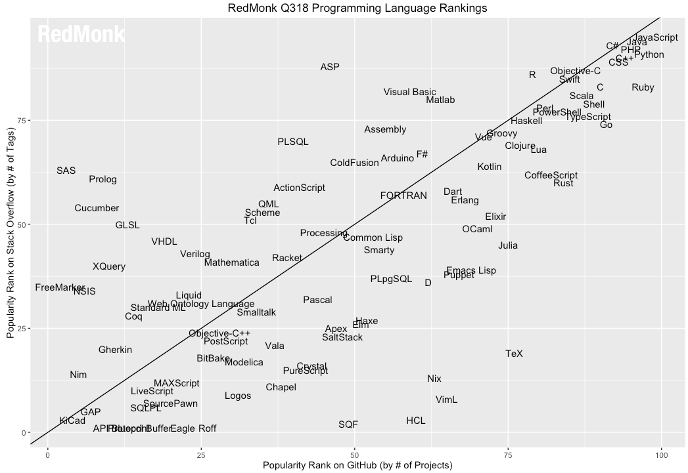

```{r setup, echo = F}
## Setup for your presentation
library(knitr)

opts_chunk$set(
  eval = T,
  cache = T,
  comment = "#",
  collapse = TRUE,
  warning = FALSE,
  message = FALSE,
  fig.width=5, fig.height=5,
  fig.align = 'center'
)


hook_output <- knit_hooks$get("output")
knit_hooks$set(output = function(x, options) {
  lines <- options$output.lines
  if (is.null(lines)) {
    return(hook_output(x, options))  # pass to default hook
  }
  x <- unlist(strsplit(x, "\n"))
  more <- "..."
  if (length(lines)==1) {        # first n lines
    if (length(x) > lines) {
      # truncate the output, but add ....
      x <- c(head(x, lines), more)
    }
  } else {
    x <- c(more, x[lines], more)
  }
  # paste these lines together
  x <- paste(c(x, ""), collapse = "\n")
  hook_output(x, options)
})
```

```{r, echo = F}
mypar = list(mar = c(3,3,1,0.5), mgp = c(1.6, 0.3, 0), tck = -.02, cex = 1.5)

options(repos=structure(c(CRAN="http://cran.r-project.org")))
```

```{r, include = FALSE}
if (!require(vegan)) install.packages("vegan")
library(vegan)
if (!require(ade4)) install.packages("ade4")
library(ade4)
if (!require(scales)) install.packages("scales")
library(scales)
```

class: inverse, center, middle

# R?

## <i class="fa fa-commenting-o" aria-hidden="true"></i>


---
# R

<br>

> R is a programming language and free software environment for statistical computing and graphics [...].

<br>

> The R language is widely used among statisticians and data miners for developing statistical software and data analysis. Polls, data mining surveys, and studies of scholarly literature databases show substantial increases in popularity in recent years.

[R (programming language) -- Wikipedia](https://en.wikipedia.org/wiki/R_(programming_language)


---
# R, Python, Julia, ...

.center[]

[Python](https://www.python.org/) / [Julia](https://julialang.org/)


---
# R is popular

.center[]


---
# R is popular

1. Efficient data manipulation
2. Many package
3. stats everywhere
4. Extensions ++


---
# R is popular
<br>

- [R project](https://www.r-project.org/)
- [CRAN](https://cran.r-project.org/)
- [MetaCRAN](https://www.r-pkg.org/)
- [R Package Documentation](https://rdrr.io/)


---
# R, RStudio, Ropenscience?

## Main links

- [R project](https://www.r-project.org/)
- [RStudio](https://www.rstudio.com/)
- [rOpenSci](https://ropensci.org)

## Get reliable documentation

- [CRAN Manual & Contributed](https://cran.r-project.org/)
- [bookdown](https://bookdown.org/)
- [RStudio](https://www.rstudio.com/)
  - [Cheat Sheets](https://www.rstudio.com/resources/cheatsheets/)
  - [Webinars](https://resources.rstudio.com/webinars)
- [QCBS](https://qcbsrworkshops.github.io/Workshops/)
- [<i class="fa fa-stack-overflow" aria-hidden="true"></i>](https://stackoverflow.com/questions/tagged/r)


---
# Outline
<br>

- data manipulations ~ 50min
- data visualization ~1h
- *lunch break*
- mapping ~ 1h30
- *coffee break* ~ 10min
- ordination ~1h30


---
class: inverse, center, middle

# Data manipulation

## <i class="fa fa-wrench" aria-hidden="true"></i>


---
# Let's start
<br>

- R console / R GUI / RStudio / ...

```R
install.packages(c("tidyverse", "sf", "raster", "mapview", "vegan", "ade4",
  "scales", "xaringan"))
```

---
# R's principles

1. Everything is R is an object

```{R, princ1}
class(2)
class("A")
class(library)
plot
```

2. Everything that is happening is R is a function call

3. interface


---
# Basic commands

```{R, basic}
2+2
let <- LETTERS[1:10]
# NB: = works too
let
let2 <- sample(let, 5)
let2
```

Get documentation

```R
?sample
```

---
# Basic commands

```{R, basic2}
vec <- c(2:5, 9:12, 18)
vec
```

---
# vector and matrix

```{R, vec}
vec
let
# vector of size 1
let[1]
```

```{R, mat}
# use arguments
mat <- matrix(1, ncol = 3, nrow = 6)
mat
mat[1,2]
mat[,2]
mat[3,2]
```


---
# data frames

```{R}
library(datasets)
head(CO2)
```

```{R}
CO2[2,1]
CO2[,1]
CO2$Plant
```


---
# Lists

```{R}
mylist <- list(CO2, mat, let[1], awesome = "cool")
names(mylist)
mylist$awesome
mylist[1:2]
mylist[[1]]

```


---
# For loops


NB while loop infinite loop until a certain condition is met

---
# Logical conditions

vec <- 1:10
vec  > 5
vec[vec>5]


---
class: inverse, center, middle

# Questions?

## <i class="fa fa-question-circle-o" aria-hidden="true"></i>


---
# Tidyverse - a metapackage

<br>


```{R}
library(tidyverse)
```

### <i class="fa fa-wrench" aria-hidden="true"></i> A great tool belt for data science [<i class="fa fa-external-link" aria-hidden="true"></i>](https://www.tidyverse.org/)

--

- <i class="fa fa-check" aria-hidden="true"></i> Pros:
  - Well-documented, intuitive,
  - efficient,
  - very popular

- <i class="fa fa-exclamation-triangle" aria-hidden="true"></i>Cons:
  - an alternative way of doing the same manipulation things,
  - prevent the user from learning programming basis


---
# Tidyverse - what will be used and covered


---
# Basic data manipulations

0. Read files

1. Filter

2. Select

3. Mutate

4. Aggregate

5. Joint

6. figure / write files


---
# Read a file

read.csv
readr::read_csv

read.table
package to connect to sql, mongodb,
XXX fchier speciaux geol??


---
# ade4

```{R}
library(ade4)
df <- data(doubs)
```

---
# Piping


---
# Filter

---
# Select

---
# Mutate

---
# Aggregate

---
# Joint

---
# Write files


---
class: inverse, center, middle

# Data visualization

## <i class="fa fa-bar-chart" aria-hidden="true"></i>


---
# graphics, grid and more


---
# ggplot2


---
# What's the big idea

1. grammar of graohics

2. yourplot <- gg_XX1 + gg_XX2 + gg_XX3

3. new plots? Code a new gg_XXX


---
# histograms


---
# pie chart

---
# get circular
