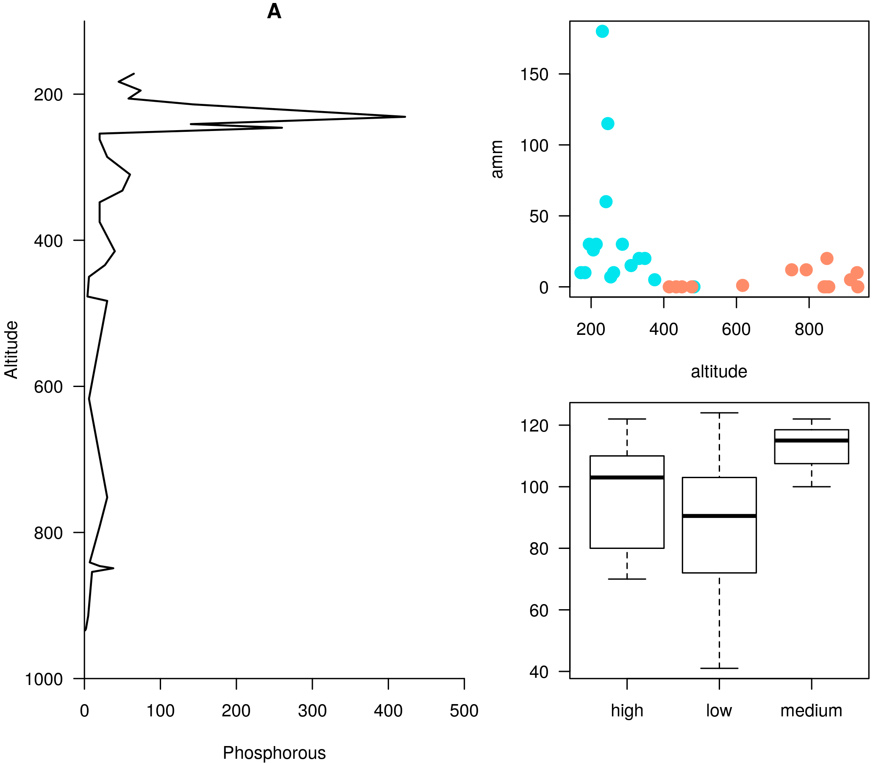

```{r setup, echo = F}
## Setup for your presentation
library(knitr)

opts_chunk$set(
  eval = TRUE,
  cache = FALSE,
  comment = "#",
  collapse = TRUE,
  warning = FALSE,
  message = FALSE,
  fig.width=5, fig.height=5,
  dpi = 300,
  fig.align = 'center'
)


hook_output <- knit_hooks$get("output")
knit_hooks$set(output = function(x, options) {
  lines <- options$output.lines
  if (is.null(lines)) {
    return(hook_output(x, options))  # pass to default hook
  }
  x <- unlist(strsplit(x, "\n"))
  more <- "..."
  if (length(lines)==1) {        # first n lines
    if (length(x) > lines) {
      # truncate the output, but add ....
      x <- c(head(x, lines), more)
    }
  } else {
    x <- c(more, x[lines], more)
  }
  # paste these lines together
  x <- paste(c(x, ""), collapse = "\n")
  hook_output(x, options)
})

options(width = 92)
```

```{r, echo = F}
mypar = list(mar = c(3,3,1,0.5), mgp = c(1.6, 0.3, 0), tck = -.02, cex = 1.5)

options(repos=structure(c(CRAN="http://cran.r-project.org")))
```

```{r, include = FALSE}
if (!require(vegan)) install.packages("vegan")
library(vegan)
if (!require(ade4)) install.packages("ade4")
library(ade4)
if (!require(scales)) install.packages("scales")
library(scales)
```

```{r echo = FALSE}
knitr::read_chunk("scripts/code_R.R")
```

---
# Aims

<br>

### &nbsp; Better ideas about what R actually is
### &nbsp; Better ideas about what R can do
### &nbsp; Better ideas about the topics covered

---
# Outline

### &nbsp; <i class="fa fa-commenting-o" aria-hidden="true"></i> R? ~10min
### &nbsp; <i class="fa fa-wrench" aria-hidden="true"></i> Data manipulations ~1h15min
### &nbsp; <i class="fa fa-bar-chart" aria-hidden="true"></i> Data visualization (part1) ~30min
### &nbsp; <i class="fa fa-cutlery" aria-hidden="true"></i> Lunch break 12pm
### &nbsp; <i class="fa fa-bar-chart" aria-hidden="true"></i> Data visualization (part2) ~30min
### &nbsp; <i class="fa fa-map" aria-hidden="true"></i> mapping ~ 1h30
### &nbsp; <i class="fa fa-coffee" aria-hidden="true"></i> *coffee break* 3pm
### &nbsp; <i class="fa fa-sitemap" aria-hidden="true"></i> ordination ~1h30


---
class: inverse, center, middle

# R?

## <i class="fa fa-commenting-o" aria-hidden="true"></i>


---
# R

<br>

> R is a programming language and free software environment for statistical computing and graphics [...].

<br>

> The R language is widely used among statisticians and data miners for developing statistical software and data analysis.

[R (programming language) - Wikipedia](https://en.wikipedia.org/wiki/R_(programming_language)


---
# R is popular

.center[]

[Python](https://www.python.org/) / [Julia](https://julialang.org/)


---
# R is popular among Biological Sciences

### For instance

1. Ecologists
2. Bioinformatics [(Bioconductor)](https://www.bioconductor.org/)
3. Medicine [<i class="fa fa-external-link" aria-hidden="true"></i>](https://r-medicine.com/)

--

### Why?

1. An incredible tool for statistics
2. Fairly accessible for non-programmer people
3. A very high diversity of packages


---
# R is popular

.center[]

[*CRAN now has 10,000 R packages* Revolutions. January, 2017](https://blog.revolutionanalytics.com/2017/01/cran-10000.html)

[MetaCRAN](https://www.r-pkg.org/) / [R Package Documentation](https://rdrr.io/)


---
# R, RStudio, Ropenscience?

### Main links

- [R project](https://www.r-project.org/)
- [CRAN](https://cran.r-project.org/)
- [RStudio](https://www.rstudio.com/)
- [rOpenSci](https://ropensci.org)

### Get reliable documentation

- [CRAN Manual & Contributed](https://cran.r-project.org/)
- [bookdown](https://bookdown.org/)
- [RStudio](https://www.rstudio.com/)
  - [Cheat Sheets](https://www.rstudio.com/resources/cheatsheets/)
  - [Webinars](https://resources.rstudio.com/webinars)
- [QCBS](https://qcbsrworkshops.github.io/Workshops/)
- [DataCarpentery](https://datacarpentry.org/R-genomics/index.html)
- [<i class="fa fa-stack-overflow" aria-hidden="true"></i>](https://stackoverflow.com/questions/tagged/r)


---
class: inverse, center, middle

# Data manipulation

## <i class="fa fa-wrench" aria-hidden="true"></i>


---
# Let's start
<br>

- Open R console / R GUI / RStudio / ...

--

```R
getwd()
setwd("pasth2workingdirectory")
```

--

- Install the following packages

```R
install.packages(c("tidyverse", "sf", "raster", "mapview", "vegan", "ade4",
  "scales", "xaringan"))
```

---
# R's principles
<br>


### 1. Everything in R is an object

### 2. Everything that happens in R is a function call

### 3. Interfaces to other software are part of R.


[Extending-R by Chambers](https://www.crcpress.com/Extending-R/Chambers/p/book/9781498775717)

---
# Everything in R is an object
<br>

```{R}
2
```

--

```{R}
class(2)
```
--

```{R}
class("A")
class(library)
plot
```

---
class: center
# Everything that happens in R is a function call
<br>

```R
class(2)
```
## <i class="fa fa-arrow-circle-o-down" aria-hidden="true"></i>

### `enter`

## <i class="fa fa-arrow-circle-o-down" aria-hidden="true"></i>

```{R, echo = FALSE}
class(2)
```


---
# Interfaces to other software are part of R
<br>

### Four examples among many others:

- [Rcpp](https://cran.r-project.org/web/packages/Rcpp/index.html)

- [Reticulate](https://rstudio.github.io/reticulate/index.html)

- [Rmarkdown](https://rmarkdown.rstudio.com/)

- [plotly](https://plot.ly/r/)

- [mapview](https://r-spatial.github.io/mapview/)


---
# Basic commands

```{R, basic1}
2+2
2*3
3>2
```

--

```{R, basic2}
let <- LETTERS[1:10]
let2 = LETTERS[1:10]
let
let2
identical(let, let2)
```

--
```{R, basic3}
let3 <- sample(let, 5)
let2
```

--

```R
# Functions documentation
?sample
```

---
# Vectors

**Create a vector**

```{R, basic4}
vec <- c(2:5, 9:12, 2)
vec
vec > 4
```

--

```{R, vec}
let
length(let)
```
--

**Subset a vector**

```{R, vec2}
let[1:2]
let[c(1:2, 5:6)]
let[-c(1,7)]
vec[vec > 4]
let[let > "C"]
```

---
# Matrices

```{R, mat}
# use arguments
mat <- matrix(1:18, ncol = 3, nrow = 6)
mat
dim(mat)
mat[1,2]
```
--

```{R, mat2}
mat[1,]
mat[,2]
mat[2:4, 1:2]
```

---
# Data frames

## &nbsp; &nbsp; <i class="fa fa-question-circle-o" aria-hidden="true"></i>

--

```{R, dataframe}
df <- data.frame(
  letter = let[1:5],
  val = vec[1:5],
  logic = vec[1:5]>2
)
df
class(df)
dim(df)
```

---
# Data frames

```{R, dataframe2}
df[1, 1]
```

```{R, dataframe3}
df$letter
df[,1]
df[1]
df[1:2]
```

```{R, dataframe4}
class(df$letter)
class(df$val)
```

---
# Data frames
<br>

```{R}
library(datasets)
```

To see the list of available datasets:

```R
data()
```

To access the documentation of a particular dataset:

```R
?CO2
```


---
# Data frames

```{R}
library(datasets)
head(CO2)
names(CO2)
summary(CO2)
```

--

```{R}
CO2$Plant
```


---
# Lists

```{R}
mylist <- list(CO2 = CO2, mymat = mat, mylet = let[1], awesome = "cool")
names(mylist)
mylist$awesome
mylist[3:4]
```

--

```{R}
class(mylist[2])
class(mylist[[2]])
mylist[[2]]
class(mylist[[2]][2,3])
mylist[[2]][2,3]
```


---
# For loops

```{R}
for (i in 1:4) {
  # actions
  print(i)
}
```

```{R}
for (j in LETTERS[1:5]) {
  print(j)
}
```

```{R}
for (i in c(1,4,6)) {
  print(i)
}
```


---
# Logical conditions &nbsp; > &nbsp; >= &nbsp; < &nbsp; <= &nbsp; == &nbsp; !=

--

```{R}
vec <- c(2:5, 9:12, 2)
vec
vec[1] > 4
vec > 4
```

--

`if` ... `else` ...

```{R}
for (i in vec) {
  if (i <= 5) {
   # actions
   print(i)
 } else {
   print("nope")
 }
}
```


---
class: inverse, center, middle

# Questions?

## <i class="fa fa-question-circle-o" aria-hidden="true"></i>


---
# Tidyverse - a metapackage

<br>


```{R}
library(tidyverse)
```

### <i class="fa fa-wrench" aria-hidden="true"></i> A great tool belt for data science [<i class="fa fa-external-link" aria-hidden="true"></i>](https://www.tidyverse.org/)

--

- <i class="fa fa-check" aria-hidden="true"></i> Pros:
  - well-documented, intuitive
  - efficient
  - very popular

- <i class="fa fa-exclamation-triangle" aria-hidden="true"></i>Cons:
  - an alternative way of doing the same manipulation things
  - prevents the user from learning programming basics


---
# Data manipulations
<br>

### &nbsp; 1. Import data / read file(s) <i class="fa fa-arrow-circle-right" aria-hidden="true"></i> get R object(s)
### &nbsp; 2. Select / Filter <i class="fa fa-arrow-circle-right" aria-hidden="true"></i> find the data of interest
### &nbsp; 3. Join <i class="fa fa-arrow-circle-right" aria-hidden="true"></i> combine data
### &nbsp; 4. Mutate / Aggregate <i class="fa fa-arrow-circle-right" aria-hidden="true"></i> create new data
### &nbsp; 5. Cast and Melt <i class="fa fa-arrow-circle-right" aria-hidden="true"></i> Format your data
### &nbsp; 6. R object(s) <i class="fa fa-arrow-circle-right" aria-hidden="true"></i> Export data / write file(s)


---
# Read a file

```{R, read}
df2 <- read.csv("data/environ.csv")
head(df2, 3)
class(df2)
```
--

```{R, readr}
df3 <- read_csv("data/environ.csv")
head(df3, 3)
class(df3)
```

--

- `read.table()`
- [SQL in R](http://dept.stat.lsa.umich.edu/~jerrick/courses/stat701/notes/sql.html)
- [MongoDB in R](https://jeroen.github.io/mongolite/)
- [MariaDB](https://mariadb.com/kb/en/library/r-statistical-programming-using-mariadb-as-the-background-database/)

---
# Dataset 'doubs' in package 'ade4'
<br>

```{R, doubs}
library(ade4)
data(doubs)
# ?doubs
```

--

```{R}
class(doubs)
names(doubs)
head(doubs$env)
```


---
# Dataset 'doubs' in package 'ade4'
<br>

```{R}
as_tibble(doubs$env)
```

---
# Piping

--

```{R, pip1}
res <- as_tibble(data.frame(res = log(diff(exp(1:6)))))
res
```

--

```{R, pip2}
# library(magrittr)
res <- 1:6 %>% exp %>% diff %>% log %>% as.data.frame(col.names = "res") %>% as_tibble
res
```


---
# Select

--

```{R}
denv <- as_tibble(doubs$env)
dim(denv)
names(denv)
head(denv, 20)
```

---
# Select

```{R}
head(denv[, c(1:2, 5)])
head(denv[, c("dfs", "alt", "pH")])
```

---
# Select

```{R}
denvS <- denv %>% select(dfs, alt, pH)
head(denvS)
```

```{R}
denvS <- denv %>% select(alt, pH, dfs)
head(denvS)
```


---
# Select

```{R}
head(denv[, -c(1:2, 5)])
# head(denv[, -c("dfs", "alt", "pH")]) won't work
```

```{R}
denv %>% select(-dfs, -alt, -pH)
```


---
# Filter

```{R}
denv$alt
```

--

```{R, filter}
denvF <- denv %>% dplyr::filter(alt > 400)
denvF
```

---
# Filter
<br>

```{R}
denvF2 <- denv %>% dplyr::filter(alt > 400 & pH>=80)
denvF2
```

---
# Filter
<br>

```{R}
denvF3 <- denv %>% dplyr::filter(alt > 600 | pH>=82)
denvF3
```

---
# Filter
<br>

Selection + Filter

--

```{R}
denvF4 <- denv %>% select(dfs, alt, pH) %>% dplyr::filter(alt > 400 & pH>=80)
denvF4
```


---
# Mutate
<br>

--

```{R, mutate}
denvM <- denv %>% mutate(pH2 = pH + 1)
denvM
```

---
# Mutate
<br>


```{R}
denvM2 <- denv %>% mutate(index = 2*nit + pho + amm)
denvM2
```


---
# Mutate

```{R}
denvM3 <- denv %>%
  select(dfs, alt, pH, nit, pho, amm) %>%
  dplyr::filter(alt > 400) %>%
  mutate(pH2 = pH + 1) %>%
  mutate(index = 2*nit + pho + amm)
denvM3
```

---
# Mutate

```{R}
model <- denv %>%
  select(dfs, alt, pH, nit, pho, amm) %>%
  dplyr::filter(alt > 400) %>%
  mutate(pH2 = pH + 1) %>%
  mutate(index = 2*nit + pho + amm) %>%
  lm(index ~ pH2, data = .)
summary(model)
```

---
class: inverse, center, middle

# Questions?

## <i class="fa fa-question-circle-o" aria-hidden="true"></i>


---
# Join
<br>

--


```{R}
dfis <- doubs$fish
head(denv, 4)
head(dfis, 4)
```

---
# Join
<br>

```{R}
denv <- denv %>% mutate(idSite = 1:nrow(denv))
head(denv, 4)

dfis$idSite <- 1:nrow(denv)
head(dfis, 4)
```

---
# Join
<br>

```{R}
dmerg <- denv %>% inner_join(dfis)
head(dmerg)
dim(dmerg)
```

---
# Join
<br>

### Different way of joining data frame [(see documentation)](https://dplyr.tidyverse.org/reference/join.html)


```{R}
dmerg1 <- denv[-1,] %>% inner_join(dfis[-2,])
dim(dmerg1)
```

--

```{R}
dmerg2 <- denv[-1,] %>% right_join(dfis[-2,])
dmerg3 <- denv[-1,] %>% left_join(dfis[-2,])
dmerg4 <- denv[-1,] %>% full_join(dfis[-2,])
dim(dmerg2)
dim(dmerg3)
dim(dmerg4)
```


---
# Aggregate
<br>

--

```{R}
denv2 <- denv %>% mutate(nit2 = nit >=125)
denv2
```

---
# Aggregate
<br>

```{R}
denv2$alt2 <- "low"
denv2$alt2[denv2$alt>450] <- "medium"
denv2$alt2[denv2$alt>750] <- "high"
denv2$alt2 <- as.factor(denv2$alt2)
denv2
```


---
# Aggregate
<br>

```{R}
denv2 %>% group_by(nit2) %>% summarize(n())
denv2 %>% group_by(nit2, alt2) %>% summarize(n())
```

---
# Aggregate
<br>

```{R}
denv2 %>% group_by(nit2) %>% summarize(n())
denv2 %>% group_by(nit2, alt2) %>%
  summarize(nb_obs = n(), mean_amm = mean(amm), sd_oxy = sd(oxy))
```


---
# Write files

### Write data frames

```{R, write}
write.csv(dmerg, "output/dmerg.csv")
write_csv(dmerg, "output/dmerg2.csv")
```
--

### Write any R objects

```{R}
saveRDS(doubs, "output/doubs.rds")
# readRDS("output/dmerg.rds")
write_rds(doubs, "output/doubs.rds")
# read_rds
```


---
class: inverse, center, middle

# Data visualization

## <i class="fa fa-bar-chart" aria-hidden="true"></i>


---
# Data visualization
<br>

## [Material +](https://insileco.github.io/Visualisation-SentinelleNord/#1)

## [bookdown](https://bookdown.org/)


---
# Components
<br>

.pull-left[
- "a chart is worth a thousand words"
]

.pull-right[

```{r echo=FALSE}
<<load_data>>
<<component_1>>
```
]


---
# Components
<br>

.pull-left[
- "a chart is worth a thousand words"
- plot window
]

.pull-right[

```{r echo=FALSE}
<<load_data>>
<<component_2>>
```
]

---
# Components
<br>

.pull-left[
- "a chart is worth a thousand words"
- plot window
- plot region
]


.pull-right[
```{r echo=FALSE}
<<load_data>>
<<component_3>>
```
]

---
# Components
<br>

.pull-left[
- "a chart is worth a thousand words"
- plot window
- plot region
- data
]


.pull-right[
```{r echo=FALSE}
<<load_data>>
<<component_4>>
```
]

---
# Components
<br>

.pull-left[

- "a chart is worth a thousand words"
- plot window
- plot region
- data
- axes
]

.pull-right[

```{r echo=FALSE}
<<load_data>>
<<component_5>>
```
]

---
# Components
<br>

.pull-left[

- "a chart is worth a thousand words"
- plot window
- plot region
- data
- axes
- title
]


.pull-right[
```{r echo=FALSE}
<<load_data>>
<<component_6>>
```
]


---
# Components
<br>

.pull-left[
- "a chart is worth a thousand words"
- plot window
- plot region
- data
- axes
- titles
- legend
]


.pull-right[
```{r echo=FALSE}
<<load_data>>
<<component_7>>
```
]


---
# graphics vs grid
<br>

.center[]

Murrell, P. (2015) [The gridGraphics Package]("https://journal.r-project.org/archive/2015-1/murrell.pdf"). The R Jounal.


---
# Workflows


### Base plot

```R
dev(...)
par(...)
plot(...)
fun1(...)
fun2(...)
dev.off()
```

<br>

### ggplot2

```R
myplot <- ggplot() + gg_XX1 + gg_XX2 + gg_XX3
myplot
ggsave(...)
```

---
# Hundreds of packages
<br>

### [List of packages](https://insileco.github.io/wiki/rgraphpkgs/)
### [r-graph-gallery](https://www.r-graph-gallery.com/)
### [data-to-viz](https://www.data-to-viz.com/)
### [Cookbook for R](http://www.cookbook-r.com/Graphs/)

---
# Basic plots

.pull-left[

```{R}
# denv as used above
plot(x = denv2$alt,
  y = denv2$amm)
```
]


.pull-right[
```{R}
p <- denv2 %>% ggplot(aes(x = alt, y = amm)) +
  geom_point()
p
```
]


---
# Basic plots

.pull-left[

```{R}
plot(x = denv2$alt,
  y = denv$amm,
  type = "l")
```
]


.pull-right[
```{R}
p <- denv2 %>% ggplot(aes(x = alt, y = amm)) +
  geom_line()
p
```
]


---
# Basic plots

.pull-left[

```{R}
par(las = 1)
plot(x = denv2$alt, y = denv$amm,
  type = "l", xlab = "altitude", ylab = "amm")
```
]


.pull-right[
```{R}
p <- denv2 %>% ggplot(aes(x = alt, y = amm)) +
  geom_line()
p
```
]

---
# Basic plots

.pull-left[

```{R}
par(las = 1)
plot(x = denv2$alt, y = denv$amm,
  xlab = "altitude", ylab = "amm", type = "l")
```
]


.pull-right[
```{R}
p <- denv2 %>% ggplot(aes(x = alt, y = amm)) +
  geom_line() + xlab("altitude") + theme_bw()
p
```
]

---
# Basic plots

.pull-left[

```{R}
par(las = 1)
plot(x = denv2$alt, y = denv$amm,
  xlab = "altitude", type = "l")
```
]


.pull-right[
```{R}
p <- denv2 %>% ggplot(aes(x = alt, y = amm)) +
  geom_line() + xlab("altitude") + theme_bw()
p
```
]


---
# Basic plots

.pull-left[

```{R}
par(las = 1)
plot(x = denv2$alt, y = denv$amm, pch = 19,
  col = denv2$nit2)
```
]


.pull-right[
```{R}
p <- denv2 %>% ggplot(aes(x = alt, y = amm,
  colour = nit2)) + geom_point() + xlab("altitude") + theme_bw()
p
```
]


---
# Basic plots


```{R}
colors()[1:50]
library(RColorBrewer)
```

---
# Basic plots

.pull-left[

```{R}
par(las = 1)
plot(x = denv2$alt, y = denv$amm, pch = 19, xlab = "altitude", ylab = "amm",
  col = c("salmon1", "turquoise2")[denv2$nit2+1], cex = 2)
```
]


.pull-right[
```{R}
p <- denv2 %>% ggplot(aes(x = alt, y = amm, colour = nit2)) +
  geom_point(size = 3) + xlab("altitude") + theme_bw()
p
```
]


---
# Basic plots

.pull-left[

```{R}
par(las = 1, mar = c(4,4,1,1))
plot(x = denv2$alt, y = denv$amm, pch = 19, xlab = "altitude", ylab = "amm",
  col = c("salmon1", "turquoise2")[denv2$nit2+1], cex = 1.5)
```
]


.pull-right[
```{R}
p <- denv2 %>% ggplot(aes(x = alt, y = amm, colour = nit2)) +
  geom_point(size = 3) + xlab("altitude") + theme_bw()
p
```
]


---
# Export your figure
<br>

```R
png("output/figb.png", unit = "in", width = 6, height = 5, res = 300)
par(las = 1, mar = c(4,4,1,1))
plot(x = denv2$alt, y = denv$amm, pch = 19, xlab = "altitude", ylab = "amm",
  col = c("salmon1", "turquoise2")[denv2$nit2+1], cex = 1.5)
dev.off()
```

---
# Export your figure
<br>

```R
p <- denv2 %>% ggplot(aes(x = alt, y = amm, colour = nit2)) +
  geom_point(size = 3) + xlab("altitude") + theme_bw()
ggsave("output/figg.png", unit = "in", width = 6, height = 5)
```


---
# Hints
<br>

### Base plots

- remove all components and add one layer at a time
- use `?par` as well as the help of the functions you'll use

<br>

### ggplot2

- https://ggplot2.tidyverse.org/
- find the geom (`gg_XXX`) you need: [ggplot2 extensions](https://www.ggplot2-exts.org/)


---
# Other graphs?
<br>

## [Cookbook for R](http://www.cookbook-r.com/Graphs/)

## [r-graph-gallery](https://www.r-graph-gallery.com/)


---
# Boxplots

`amm` vs in `denv2`

--

### Baseplot

- `boxplot()`
-  `par()`

--

### ggplot2

- `geom_boxplot()`


---
# Boxplots

.pull-left[

```{R}
par(las = 1)
boxplot(oxy~alt2, data = denv2)
```
]


.pull-right[
```{R}
p <- denv2 %>% ggplot(aes(x = alt2, y = oxy)) + geom_boxplot()
p
```
]


---
# Custom plot
<br>

- Let's create a 3-panels figure

```{R}
mat <- matrix(c(1,1,2,3), 2, 2)
mat
```


---
# Custom plot - 3 panels
<br>

.pull-left[
```R
layout(mat, widths = c(1.5, 1))
layout.show(3)
```
]

.pull-right[
```{R, fig.width = 4, fig.height = 4, echo = FALSE}
layout(mat, widths = c(1.5, 1))
layout.show(3)
```
]

---
# Custom plot - 3 panels
<br>

.pull-left[
```R
layout(mat, widths = c(1.1, 1))
par(las = 1, mar = c(4,4,1,1))
#-- Panel 1
plot(1,1)
#-- Panel 2
plot(x = denv2$alt, y = denv$amm,
  pch = 19, xlab = "altitude", ylab = "amm",
  col = c("salmon1", "turquoise2")[denv2$nit2+1], cex = 1.2)
#--  Panel 3
boxplot(amm~alt2, data = denv2, ylim = c(0, 80))
```
]

.pull-right[
```{R, fig.width = 4, fig.height = 4, echo = FALSE}
layout(mat, widths = c(1.2, 1))
par(las = 1, mar = c(4,4,1,1))
#-- Panel 1
plot(1,1)
#-- Panel 2
plot(x = denv2$alt, y = denv$amm,
  pch = 19,
  xlab = "altitude", ylab = "amm",
  col = c("salmon1", "turquoise2")[denv2$nit2+1],
  cex = 1.5)
#--  Panel 3
boxplot(amm~alt2, data = denv2,
  ylim = c(0, 80))
```
]

---
# Custom plot - 3 panels
<br>

```{R, fig.width = 6, fig.height = 6, echo = FALSE}
layout(mat, widths = c(1.2, 1))
par(las = 1, mar = c(4,4,1,1))
#-- Panel 1
plot(denv2$alt, denv2$pho)
#-- Panel 2
plot(x = denv2$alt, y = denv$amm, pch = 19,
  xlab = "altitude", ylab = "amm",
  col = c("salmon1", "turquoise2")[denv2$nit2+1],
  cex = 1.5)
#--  Panel 3
boxplot(amm~alt2, data = denv2,
  ylim = c(0, 80))
```


---
# Custom plot - Panel 1


.pull-left[
```R
plot(denv2$pho, -denv2$alt)
```
]

.pull-right[
```{R, echo = FALSE}
plot(denv2$pho, -exp(denv2$alt))
```
]

---
# Custom plot - Panel 1


.pull-left[
```R
par(las = 1, bty = "l")
plot(denv2$pho, -denv2$alt,
  ann = FALSE, axes = FALSE,
  type = "n")
```
]

.pull-right[
```{R, echo = FALSE}
par(las = 1, bty = "l")
plot(denv2$pho, -denv2$alt, ann = FALSE, axes = FALSE, type = "n")
```
]

---
# Custom plot - Panel 1


.pull-left[
```R
par(las = 1, bty = "l")
plot(denv2$pho, -denv2$alt,
  ann = FALSE, axes = FALSE,
  type = "n", xlim = c(0, 500),
  ylim = c(-1000, 0))
points(denv2$pho, -denv2$alt,
  pch = 19, cex = 1.1)
```
]

.pull-right[
```{R, echo = FALSE}
par(las = 1, bty = "l", xaxs = "i", yaxs = "i")
plot(denv2$pho, -denv2$alt, ann = FALSE, axes = FALSE, type = "n", xlim = c(0, 500),
ylim = c(-1000, 0))
points(denv2$pho, -denv2$alt, pch = 19, cex = 1.1)
```
]


---
# Custom plot - Panel 1


.pull-left[
```R
par(las = 1, bty = "l")
plot(denv2$pho, -denv2$alt,
  ann = FALSE, axes = FALSE,
  type = "n", xlim = c(0, 500),
  ylim = c(-1000, 0))
lines(denv2$pho, -denv2$alt,
  lwd = 1.5)
axis(1)
axis(2, at = seq(-1000, 0, 200),
labels = abs(seq(-1000, 0, 200)))
```
]

.pull-right[
```{R, echo = FALSE}
par(las = 1, bty = "l", xaxs = "i", yaxs = "i")
plot(denv2$pho, -denv2$alt, ann = FALSE, axes = FALSE, type = "n", xlim = c(0, 500),
ylim = c(-1000, -100))
lines(denv2$pho, -denv2$alt, lwd = 1.5)
axis(1)
axis(2, at = seq(-1000, 0, 200),
labels = abs(seq(-1000, 0, 200)))
```
]


---
# Custom plot - Panel 1


.pull-left[
```R
par(las = 1, bty = "l")
plot(denv2$pho, -denv2$alt,
  ann = FALSE, axes = FALSE,
  type = "n", xlim = c(0, 500),
  ylim = c(-1000, 0))
lines(denv2$pho, -denv2$alt,
  lwd = 1.5)
axis(1)
axis(2, at = seq(-1000, 0, 200),
labels = abs(seq(-1000, 0, 200)))
title(main = "A",
  xlab = "Phosphorous",
  ylab = "Altitude")
```
]

.pull-right[
```{R, echo = FALSE}
par(las = 1, bty = "l", xaxs = "i", yaxs = "i")
plot(denv2$pho, -denv2$alt, ann = FALSE, axes = FALSE, type = "n", xlim = c(0, 500),
ylim = c(-1000, -100))
lines(denv2$pho, -denv2$alt, lwd = 1.5)
axis(1)
axis(2, at = seq(-1000, 0, 200),
labels = abs(seq(-1000, 0, 200)))
title(main = "A", xlab = "Phosphorous", ylab = "Altitude")
```
]


---
# Custom plot


```{R, echo = FALSE}
png("output/figure1.png", unit = "in", width = 7, height = 6, res = 300)
layout(mat, widths = c(1.2, 1))
par(mar = c(4,4,1,1))
#-- Panel 1
par(las = 1, bty = "l", xaxs = "i", yaxs = "i")
plot(denv2$pho, -denv2$alt, ann = FALSE, axes = FALSE, type = "n", xlim = c(0, 500),
ylim = c(-1000, -100))
lines(denv2$pho, -denv2$alt, lwd = 1.5)
axis(1)
axis(2, at = seq(-1000, 0, 200),
labels = abs(seq(-1000, 0, 200)))
title(main = "A", xlab = "Phosphorous", ylab = "Altitude")
#-- Panel 2
par(bty = "o", xaxs = "r", yaxs = "r")
plot(x = denv2$alt, y = denv$amm, pch = 19,
  xlab = "altitude", ylab = "amm",
  col = c("salmon1", "turquoise2")[denv2$nit2+1],
  cex = 1.5)
#--  Panel 3
boxplot(oxy~alt2, data = denv2)
```

.center[]


---
# Custom plot
<br>

- Another example: https://insileco.github.io/Visualisation-SentinelleNord/#33

- See https://insileco.github.io/VisualiseR/

- Partition with ggplot2

  - [article on sthda](http://www.sthda.com/english/wiki/ggplot2-facet-split-a-plot-into-a-matrix-of-panels)
  - [see patchwork](https://github.com/thomasp85/patchwork)
